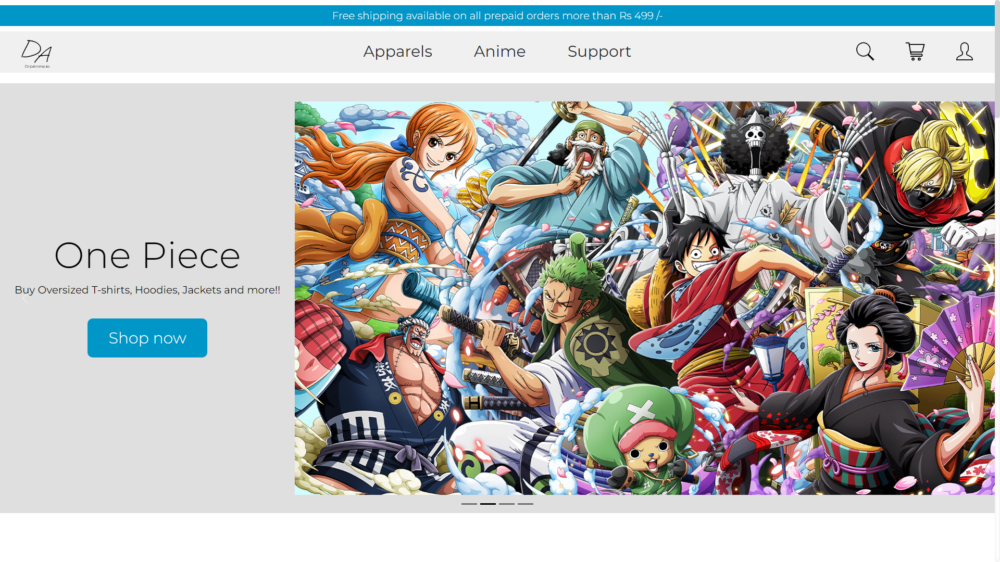
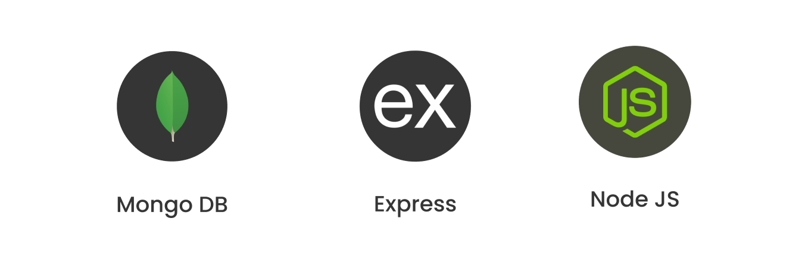

# DripAnime Store
### An online webstore for your Apparel needs!



Now this project's Backend and Database is being hosted on a third-party website hosting service "**Vercel.app**"  

>**Vercel provides the developer tools and cloud infrastructure to build, scale, and secure a faster, more personalized web.**
</br>  

### To initialize and deploy the webapp use -

```
npm build
npm run server
```
then the app will deploy on localhost with the port specified. You will get the feedback in your terminal.


### Dependancies -
1. express : ^4.18.2  
1. nodemon : ^2.0.22  
1. dotenv : ^16.4.5
1. mongoose : ^8.2.3
1. jsonwebtoken : ^9.0.2

## Tech stack used -
1. MongoDB
1. ExpressJS
1. NodeJS



_~~(No link available as the backend is being developed.)~~_  
[URL available. Click here to visit.](https://dripanime.vercel.app)

## TODOs:
1. ~~Deploy on vercel because render.com is slow af.~~
1. Add related products to the specific product page.
1. Make an anime wise section just like apparel's section.
1. Complete shopping cart page and wishlist(in profile) page.
1. Make an add to cart function with form on product page including -
    - Quantity
    - Sizes
    - Shipping info
1. Upload profile photo to user page.
1. Add card details to user page.
1. Make a to "top button" on home.
1. Make a edit profile function.
1. Make a nodemailer automail for "welcome user" notification.
1. Make a nodemailer automail for user with "order place!" notification.
1. Add a popular pick section with a infinite carousel in main page.